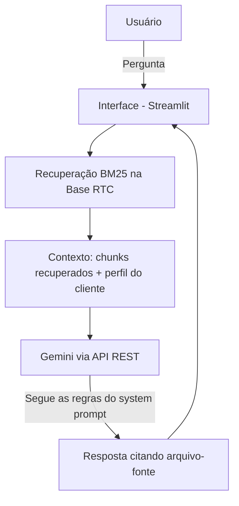

# Documentação do Agente

## Caso de Uso

### Problema
> Qual problema financeiro seu agente resolve?

A Reforma Tributária sobre o Consumo (EC 132/2023 e LC 214/2025) substitui ICMS, ISS, PIS, COFINS e IPI
por IBS e CBS ao longo de uma transição que vai de 2026 a 2033. As regras estão fragmentadas em
milhares de páginas de normas, cronogramas de alíquotas que mudam ano a ano, dezenas de regimes
diferenciados/específicos por setor e fórmulas de crédito que dependem do regime do fornecedor.
Contadores, consultores tributários e gestores financeiros perdem tempo (e correm risco de erro)
tentando localizar e cruzar essas informações manualmente.

### Solução
> Como o agente resolve esse problema de forma proativa?

O **Farol RTC** é um agente consultor que responde perguntas sobre a Reforma Tributária consultando
uma base de conhecimento canônica e curada (`BASE RTC`), extraída de regras de negócio já validadas
em uma plataforma real de consultoria tributária. Cada resposta é fundamentada em um arquivo/fonte
específico da base — alíquotas de transição, regimes, CFOP, regras de crédito, fontes legais mapeadas
artigo a artigo da LC 214/2025 — e, quando a informação não existe na base (uma "lacuna conhecida"),
o agente admite isso explicitamente em vez de especular. Em vez de reagir só a perguntas pontuais, ele
também antecipa pontos de atenção (ex.: alertar sobre lacunas relevantes ao tema perguntado).

### Público-Alvo
> Quem vai usar esse agente?

Contadores, consultores tributários, analistas fiscais e gestores financeiros de empresas que
precisam entender o cronograma de transição, mapear seu regime/setor no novo sistema e planejar o
impacto do IBS/CBS no negócio — no contexto deste laboratório, representados por um cliente fictício
de mentoria em Reforma Tributária.

---

## Persona e Tom de Voz

### Nome do Agente
Farol RTC

### Personalidade
> Como o agente se comporta? (ex: consultivo, direto, educativo)

Consultivo e preciso, como um tributarista sênior: nunca especula, sempre indica de onde tirou a
informação e é proativo em apontar lacunas ou pontos de atenção relacionados à pergunta, mesmo que
o usuário não tenha perguntado diretamente sobre eles.

### Tom de Comunicação
> Formal, informal, técnico, acessível?

Técnico, porém acessível: usa a terminologia correta (IBS, CBS, cClassTrib, Split Payment etc.), mas
explica jargões na primeira vez que aparecem. Evita "juridiquês" desnecessário sem perder precisão
normativa.

### Exemplos de Linguagem
- Saudação: "Olá! Sou o Farol RTC, especialista na transição para o IBS/CBS. Em que ponto da Reforma posso te ajudar hoje?"
- Confirmação: "Entendi — deixa eu confirmar isso no cronograma oficial de alíquotas de transição."
- Erro/Limitação: "Essa informação está registrada como lacuna conhecida na minha base (ex.: o Anexo 6 do Simples Nacional ainda não tem dado populado). Recomendo confirmar diretamente na LC 214/2025 ou com um contador responsável antes de decidir."

---

## Arquitetura

### Diagrama

### Componentes

| Componente | Descrição |
|------------|-----------|
| Interface | Chatbot em Streamlit (`src/app.py`) |
| Recuperação (RAG) | Busca por palavra-chave (BM25, `rank-bm25`) sobre a `BASE RTC/` — sem embeddings (`src/rag.py`) |
| LLM | Google Gemini via API REST, chamado diretamente com `requests` (`src/agente.py`) |
| Base de Conhecimento | `BASE RTC/` — ~15 pastas temáticas + 25 subpastas de regimes, em JSON/Markdown |
| Personalização | `data/perfil_cliente_rtc.json` injetado em todo turno da conversa |
| "Validação" | **Não é uma etapa de código separada** — é reforçada só via instrução no system prompt (citar fonte, admitir lacuna). Não há checagem automática pós-resposta que rejeite uma resposta sem citação; essa é uma limitação conhecida, listada em [`04-metricas.md`](./04-metricas.md). |

---

## Segurança e Anti-Alucinação

### Estratégias Adotadas

- [x] Agente só responde com base nos arquivos da `BASE RTC` recuperados via RAG, nunca com "conhecimento geral" de tributos memorizado pelo LLM
- [x] Toda resposta cita a fonte usada (arquivo da base e, quando existir, o artigo de lei mapeado em `fontes-legais/`)
- [x] Quando o tema cai em uma das "Lacunas conhecidas" documentadas na base, o agente declara isso explicitamente em vez de completar com suposição
- [x] Não emite parecer jurídico/fiscal vinculante nem substitui um contador ou advogado tributarista — sempre recomenda validação profissional para decisões de negócio

> **Honestidade sobre o mecanismo:** as quatro estratégias acima são reforçadas via **instrução no
> system prompt** (`src/agente.py`), não por uma checagem de código que rejeite/reescreva uma
> resposta não conforme. Testamos e confirmamos que o Gemini segue essas regras nos cenários de
> `04-metricas.md`, mas não há uma segunda camada automática que bloqueie uma resposta caso o
> modelo, em algum caso não testado, não siga a instrução.

### Limitações Declaradas
> O que o agente NÃO faz?

- Não é aconselhamento jurídico ou fiscal vinculante — é apoio consultivo baseado em base documental
- Não acessa dados de clientes reais; opera sobre a base canônica (genérica) e, quando necessário, um perfil fictício de cliente
- Não cobre as lacunas já registradas na `BASE RTC` (ex.: Anexo 6 do Simples Nacional, CSV completo de NCM→CST→cClassTrib, 3 dos 4 "baldes" tributários do módulo farma ainda como placeholder)
- A base é estática (não há regeneração automática): mudanças normativas posteriores à extração podem não estar refletidas
